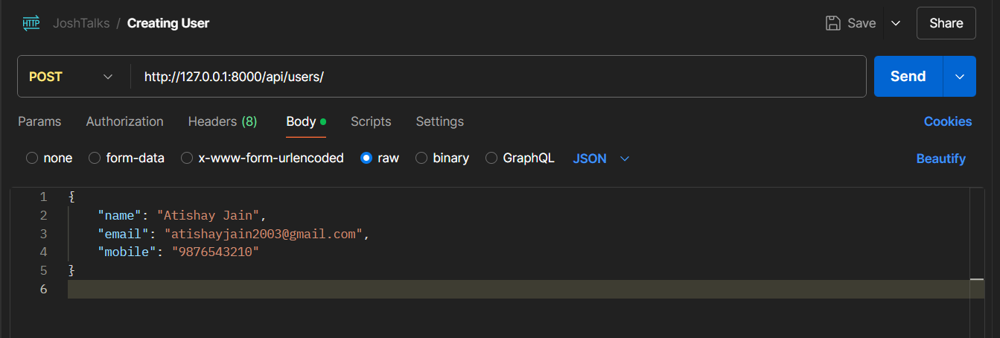
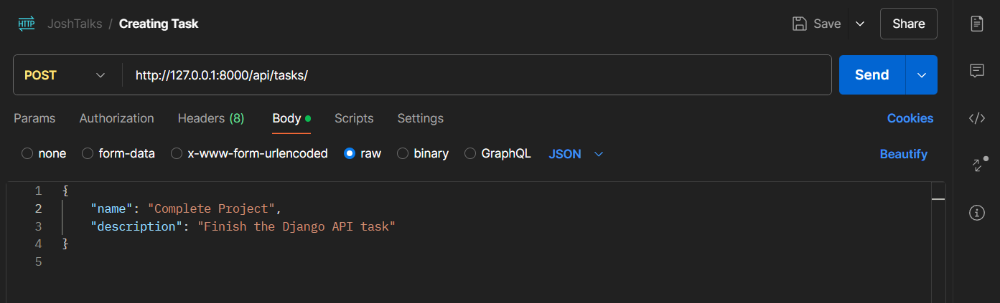
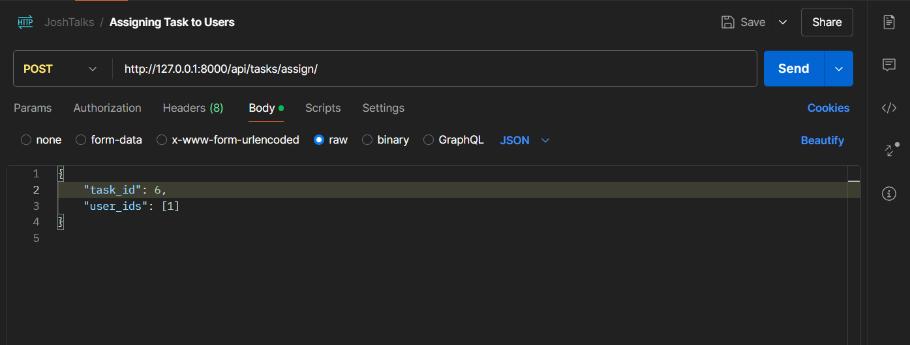
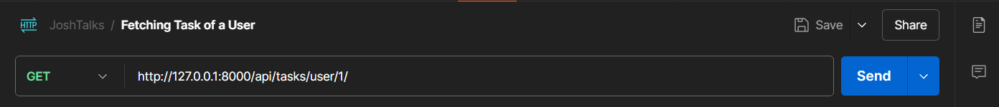

# JoshTalks
So, this project has been completed as a task as given by JoshTalks. My basic intuition for this project was the following:
1. We'll need to establish task relationship among created tasks, assigned tasks and users to facilitate task management. 
2. I have taken help of chatgpt to better my thoughtprocess in this project. 
3. The approach to solve is simple : 
   1. A user should be created
   2. Tasks should be created
   3. Tasks should be assigned, basically every user needs to be associated with some task id and vice versa
   4. Use that id to retrieve project details
4. How to run the project ?
   1. Clone the repository, move into the directory
   2. Setup and activate Virtual Environment (virtualenv env, env/scripts/activate is the command )
   3. Install requirements.txt
   4. Follow the url patterns to test the API (python manage.py runserver is the command)
   5. The url screenshots also listed for help :
      1. 
      2. 
      3. 
      4. 
5. How can the project be further improved ?
   1. Use of tokens, authentication, authorization, permission classes to make sure only authorised inviduals can assign tasks
   2. Setup and use of docker to ensure contanerization
   3. And a decent salary to this learning backend engineer, cheers :)
6. If you read it till here i am guess you have a good understanding of the project now, do let me know your take and the journey continues!